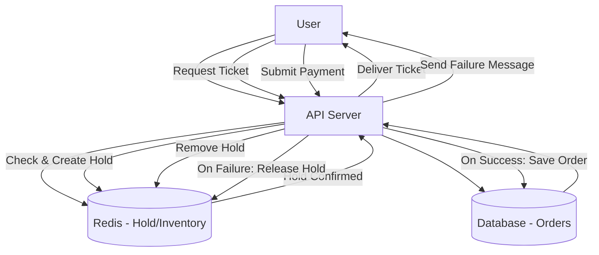
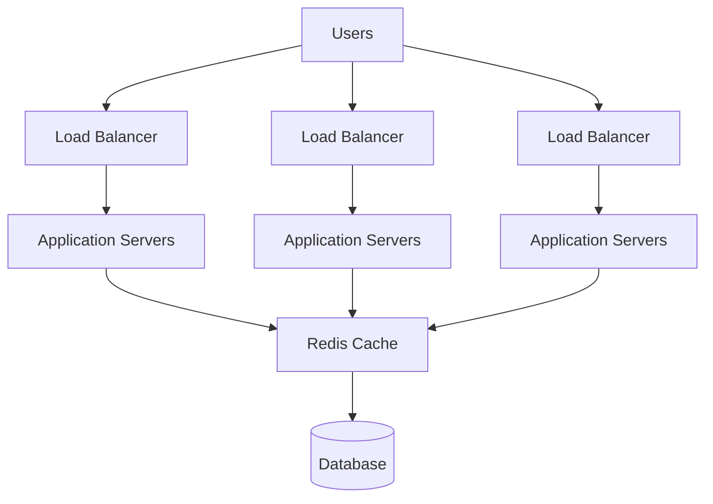

# Ticketing System: Scalability & Caching (Redis)

This document explains a cloud-native system design for a high-traffic ticketing platform and details the Redis caching strategy. It includes mermaid diagrams for architecture and purchase flow.

---

## Functional & Non‑Functional Requirements

- Availability check: Verify remaining inventory atomically (no oversell) using Redis counter per seat.
- Temporary hold: Create a reservation/hold with TTL and return reservationId + expiresAt.
- Secure payment: Submit payment for a given reservationId; integrate with payment gateway (tokenized card).
- Finalize order: On payment success, persist order, decrement authoritative DB inventory, and clear the hold.
- Failure paths: On payment failure, reject checkout and auto-release the hold when TTL expires.
- Confirmation & delivery: Return order receipt and deliver ticket via email.
- Availability: Multiple servers, Load balancing, Auto-scaling of resources.
- Throughput & burst handling: Support 5–10k reservations/min with autoscaling and queue-based payment workers.
- Reliability: Replicas of DB, Ciruit breaker.
- Consistency: Strong consistency on reservation/checkout path; eventual consistency acceptable for post-purchase emails.
- Security & compliance: TLS everywhere, Rate limiting, RBAC for ops.

# Requirements Diagram

---

# Core Components

## 1. Users
- End users accessing the ticketing platform via web or mobile.
- Actions: request ticket, submit payment.
- Can cause high-traffic.

## 2. Load Balancers
- Distribute incoming user requests across multiple Application Servers.
- Possible setups:
  - One global LB with multiple listeners.
  - Multiple LBs for different types of traffic (reservation, payment, browsing).
- Functions:
  - Basic rate limiting.
  - Health checks for servers.

## 3. Application Servers
- Stateless API servers that handle business logic.
- Responsibilities:
  - Validate request and user/session.
  - Check ticket availability in Redis.
  - Create and clear holds.
  - Confirm orders in the database after successful payment.
- Stateless design allows quick scaling up/down during traffic spikes.

## 4. Redis Cache
- In-memory cache used for:
  1. Read cache for event details.
  2. Live inventory.
- Provides atomic operations to prevent oversell.
- Acts as the first gate before database writes.

## 5. Database
- Storage for:
  - Orders.
  - Reservations.
  - Ticket inventory.
- Source of truth: Redis is fast but DB holds the final confirmed state.
- Updated only after payment success/decline.

---

## Diagram

---

# API Endpoints Overview

## 1. POST /reserve
   - Checks ticket availability.
   - Creates a temporary hold in Redis.
   - Returns `reservationId` and `expiresAt`.

## 3. POST /pay
   - Processes payment for a reservation.
   - On success → saves order in DB, removes hold, delivers tickets.
   - On failure → removes/lets hold expire.

## 4. GET /orders/{id}
   - Returns order details and tickets after payment.

## 5. GET /health
   - For monitoring: checks API health.

# Redis caching strategy

## 1. Availability Tracking
- Each event seat has a 'counter' in Redis.
- When a purchase is requested, Redis:
  1. Checks if enough tickets are available.
  2. Reserves them atomically.

## 2. Temporary Holds (TTL)
- Holds are stored as keys with an expiry time.
- Purpose:
  - Prevents others from buying the same tickets.
  - Allows safe time for the user to complete payment.

## 3. Atomic Reservation Logic
- Group multiple commands and execute together to avoid overselling of one seat.

## 4. Hold Expiry & Release
- If payment fails or time runs out:
  - TTL expiry triggers automatic removal of the hold key.

## 5. Clearing Holds on Success
- On payment success:
  - API removes hold immediately.
  - Inventory is permanently updated in the database.

# Summary – Ticketing System

The system handles high-traffic ticket sales by separating **fast, transient operations** from **durable, final storage**. Users interact with stateless API servers through load balancers. **Redis** serves as the first gatekeeper for availability, using atomic operations to check and decrement inventory, create short-lived holds (TTL), and prevent overselling under heavy concurrency.

Payments are processed asynchronously through workers to keep the reservation path fast. On payment success, the order is written to the **database** as the source of truth, the hold is cleared in Redis, and tickets are delivered. If payment fails or expires, Redis TTL automatically restores availability.

The design supports **scalability** with edge caching for reads, horizontal scaling of app servers, Redis clustering for hot events, DB read replicas, and asynchronous queues. **Observability**, and **rate limiting** protect stability.

